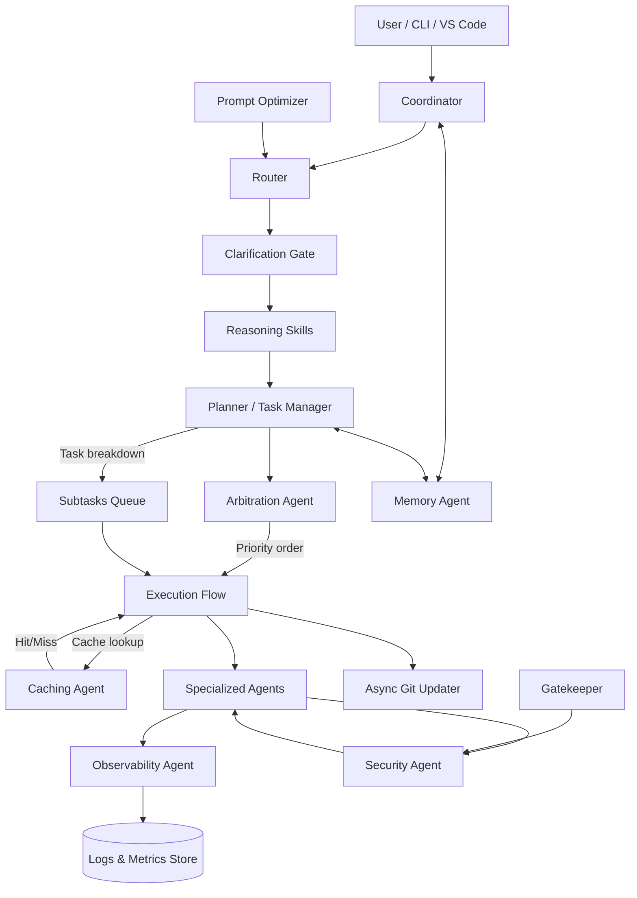

Use `docs/wiki/index.md` strictly as a navigation layer; it summarizes (never overrides) the authoritative specs, Skills, Concepts, and Synchronizations defined in this file.

# Repository Guidelines

## Stack Profiles & Project Setup
Stack-specific instructions live in `docs/stacks/`. Choose the profile that matches the current codebase and keep this file stack-agnostic.

- Default profiles: `docs/stacks/node.md` (Node/Express), `docs/stacks/python.md` (Python), `docs/stacks/go.md` (Go), `docs/stacks/frontend-react.md` (React/TypeScript), `docs/stacks/java-spring.md` (Java/Spring), `docs/stacks/rust.md` (Rust), `docs/stacks/data-ml-python.md` (Data/ML Python), `docs/stacks/dotnet-aspnet.md` (.NET/ASP.NET Core), `docs/stacks/php-laravel.md` (PHP/Laravel), `docs/stacks/mobile-android-ios.md` (Mobile Android/iOS), `docs/stacks/nextjs.md` (Next.js), `docs/stacks/sveltekit.md` (SvelteKit), `docs/stacks/vue-nuxt.md` (Vue/Nuxt), `docs/stacks/react-native.md` (React Native), `docs/stacks/flutter.md` (Flutter), `docs/stacks/electron-tauri.md` (Electron/Tauri), `docs/stacks/r-tidyverse.md` (R/Tidyverse), `docs/stacks/pyspark-databricks.md` (PySpark/Databricks), `docs/stacks/julia.md` (Julia), `docs/stacks/ruby-rails.md` (Ruby on Rails), `docs/stacks/django-drf.md` (Django/DRF), `docs/stacks/fastapi.md` (FastAPI), `docs/stacks/aws-lambda.md` (AWS Lambda), `docs/stacks/gcp-cloud-functions.md` (GCP Cloud Functions/Run), `docs/stacks/azure-functions.md` (Azure Functions), `docs/stacks/c-cpp.md` (C/C++), `docs/stacks/elixir-phoenix.md` (Elixir/Phoenix), `docs/stacks/kotlin-jvm.md` (Kotlin JVM), `docs/stacks/scala-play-akka.md` (Scala/Play/Akka), `docs/stacks/terraform.md` (Terraform), `docs/stacks/ansible.md` (Ansible), `docs/stacks/angular.md` (Angular), `docs/stacks/remix.md` (Remix), `docs/stacks/cloudflare-workers.md` (Cloudflare Workers), `docs/stacks/deno-fresh.md` (Deno/Fresh), `docs/stacks/unity.md` (Unity/C#), `docs/stacks/wordpress.md` (WordPress). Add new profiles as stacks are introduced (use `docs/stacks/STACK.template.md`) and link them in `docs/wiki/index.md`.
- Each stack doc defines layout, commands, lint/format/test tooling, and security/ops expectations. Update the profile instead of embedding stack rules in AGENTS.md.
- Keep vendor/library directories untouched so upgrades remain safe.

## Project Structure & Module Organization
- Follow the active stack profile for folder layout, naming, and entrypoints (e.g., `src/`, `app/`, `services/`).
- Keep persistent artifacts (databases, generated assets) in stack-appropriate data directories outside version control unless explicitly required.
- Group handlers/services by feature/domain; keep separation of concerns.

## Build, Test, and Development Commands
- Use the commands defined in the active stack profile/README for dev/start/lint/test/coverage flows.
- Document any new commands or scripts in the stack profile and project README so routing agents can load them reliably.
- README governance: Author `README_SPEC.yaml` first, generate `README.md` externally via `readme-spec-engine`, then run enforcement checks; never free-write the README.

## Coding Style & Naming Conventions
- Adopt lint/format rules defined by the stack profile (e.g., Standard+Prettier for Node, Black/Ruff for Python). Do not mix styles within a stack.
- Apply the repo `.editorconfig` where present; keep indentation/line endings consistent.
- Prefer the logging approach defined by the stack (e.g., `pino`, stdlib `logging`); avoid ad-hoc `console.log`/`print` in committed code.

## Testing Guidelines
- Place tests under `tests/` using the naming conventions from the stack profile (e.g., `*.test.js`, `test_*.py`).
- Use the recommended test framework per stack (Jest, Pytest, etc.) and keep fixtures near the tests.
- Ensure new modules carry direct coverage; use stack-specific coverage flags to prevent regressions.

## Commit & Pull Request Guidelines
Commit history is thin, so keep messages imperative and scoped to one change set (e.g., `Add PDF export service`). Reference issue IDs when available. Pull requests should summarize behavior changes, list any new environment variables, and attach screenshots or sample payloads for UI or API changes. Include test evidence in the PR description when functionality shifts.

### Repository Hygiene
- Sync local changes with `origin/master` frequently. After finishing a scoped task—or when notable progress lands—commit, pull/rebase if needed, and push so GitHub always mirrors the current workspace. If a push fails, resolve it immediately rather than leaving work only on the workstation.
- Treat every task cycle as incomplete until its commits are pushed to GitHub; if GitHub access is unavailable or a push cannot be completed, stop accepting new work and inform the user that no further tasks will be attempted until the repository is updated (by you or the user) and confirmed in sync.
- Reminder: push to GitHub regularly so task cycles do not stall without mirrored commits.
- Reminder: update documentation whenever framework changes land so guidance stays in sync.

## Configuration & Operations Tips
Use environment-specific config files when the stack supports them (e.g., `.env.<environment>` with `.env` fallback). Document new keys in PRs/stack profiles with safe defaults. Keep data directories (db files, generated artifacts) out of source control; place migrations/seed scripts under `scripts/` (or stack-equivalent) when added.

## Security Guidelines
- Follow the security hardening playbook in `docs/security.md` for handling secrets, access control, dependency hygiene, and incident response.
- Engage the Security Agent for any change that touches authentication, authorization, or data classification; document approvals in PR notes or `handover.md`.
- For Codex automation, adhere to the governance framework in `docs/agents.md` so PDCA workflows, spec usage, and security controls stay aligned.

## Skills Layer

Skills are reusable, first-class capability bundles. In this repository, Skills are deterministic, stateless tool packages (schema-defined JSON stdin/stdout) that execute without any LLM present; agents/LLMs select and parameterize Skills, while execution is handled by the Skill runtime implementation.

- Skills live under `/skills/` and must follow `/skills/_template/SKILL.template.md`.
- Every Skill declares the Concept(s) it supports, the governing spec IDs, required Synchronization contracts, PDCA touchpoints, validation steps, and security notes.
- Skills stay synchronized with the Concept–Synchronization architecture—they never bypass manifests, specs, or Synchronization approvals.
- Publish Skill navigation summaries to the wiki (`docs/wiki/patterns.md` and `docs/wiki/playbooks/`) so humans can discover them quickly while respecting the "wiki is not authoritative" rule.

### Skill Activation Flow
1. **Router** inspects `skills/` + the wiki index to locate candidate Skills whenever routing a task or inbox entry.
2. **Planner / Task Manager** binds a task to at most one Concept and one Skill, ensuring the spec + PDCA linkage is recorded in the plan.
3. **Execution agents** load the Skill contract/usage into the working prompt via the Prompt Optimizer, alongside the Concept manifest and Synchronization contracts, and invoke the Skill via its declared runtime entrypoint.
4. **Security + Gatekeeper** confirm the Skill’s declared permissions before any resource access.
5. **Handover** logs Skill usage plus any adjustments so downstream agents know which bundles were involved.

### Skill Maintenance
- Follow the template to add metadata (Skill ID, Concept, spec reference, PDCA checkpoints, security posture, validation hooks, linked Synchronizations).
- Skills inherit the same review cadence as specs—update the Skill when requirements, manifests, or synchronizations change.
- Document new or retired Skills in `handover.md` under “Active Skills and Recent Changes” and mirror that status in the wiki decision log.
- Never mutate a Skill silently; include the Skill ID in commits, specs, and `todo/backlog/completed` entries so reviewers can track lineage.

### Skill Usage Rules
- Search `skills/` (and the wiki index) before drafting any new instructions or bespoke tooling; reuse beats ad-hoc prompts.
- If no Skill applies, write the spec first, then create a Skill using the template so future work stays consistent.
- Prefix operational tasks tied to a Skill with `Skill: <Skill Name>` in `todo.md`, `backlog.md`, and `completed.md` to signal the binding explicitly.
- Cite the Skill ID/slug in specs, PDCA notes, handovers, and commit messages whenever its instructions guided the work.
- Treat every Skill as immutable context: agents may trim or parameterize, but they cannot rewrite the intent outside a PR.

---

## Foundational Instruction Set

### I. Core Development Scope and Stability Guidelines

These instructions define the boundaries and expectations for maintaining project stability and scope during development.

1. **External Library Management**
   - Never modify any files in library directories.
   - Libraries must remain upgradeable without risking custom code.
2. **Change Management**
   - Prioritize small, stepwise changes.
   - Avoid destructive "big swings" that are hard to recover from.
3. **Testing and Rollback**
   - Keep changes backed up so you can roll back quickly when needed.

### II. Preferred Development Methodology

1. Avoid monolithic specs—build features step by step.
2. Follow the staged build process:
   - Phase 1: describe UI elements without wiring functionality.
   - Phase 2: style/layout pass.
   - Phase 3: add local interactions.
   - Phase 4: implement core business logic.

### III. Code Quality and Maintainability

1. Refactor when required; keep separation of concerns.
2. Extract inline JS/CSS into dedicated files when feasible.
3. Comment sparingly but helpfully; optimize for human maintainers.

### IV. Workflow & Coordination

- Maintain `backlog.md`, `todo.md`, `completed.md`, and a new intake file `todo-inbox.md`.
- Intake workflow: During normal work you can add unordered list items to `todo-inbox.md` at any time without blocking ongoing operations.
- Workflow-change escalation: Any `todo-inbox.md` entry that requests updates to the workflow itself (AGENTS.md, `docs/agents.md`, context governance, etc.) must be promoted immediately into `todo.md` under Current Focus and jump the queue as the very next item to implement before regular feature work resumes.
- Workflow-change archiving: Immediately after any AGENTS.md or workflow-child update (e.g., `docs/agents.md`, `docs/context-management.md`, wiki workflow pages, `docs/humans/workflow-guide.md`), snapshot the full workflow doc set into local `ai_workflow_revisions/rev_n/` (gitignored by default; see `docs/workflow-revisions.md` for required files and numbering rules) and record the revision ID in `completed.md` + `handover.md`. Use `scripts/create-workflow-revision.sh` to ensure the snapshots include the required files and numbering.
- Workflow-governance queue: Reserve the `## Workflow Governance` section at the top of `todo.md` (between Bugs and Current Focus). Only workflow/process todos live there. Clear the section before resuming feature work so governance never lags.
- End-of-task sweep: At the end of each task, the agent reviews `todo-inbox.md`, rewords and formats items, and moves them into the appropriate files:
  - `Bugs` section → convert into actionable todos and append them under the `## Bugs` block at the very top of `todo.md`.
  - `Current Focus` section → convert into actionable todos and append to `todo.md` directly beneath the Bugs section (highest-priority non-bug work).
  - `Next Features & Updates` → convert and append to `todo.md` when appropriate capacity exists.
  - `Backlog` → convert and append to `backlog.md`.
  - Remove items from `todo-inbox.md` once moved.
- Todo formatting: use `- [ ] Task summary` in imperative voice with concise, testable wording; include brief context inline when helpful.
- Completion: when a todo is finished, move it to `completed.md` (use `- [x]`) and remove it from `todo.md`.
- **Always record every delivered change in `completed.md` before yielding a response to the user**, and add a timestamped entry to `CHANGELOG.md` for each completed task (see `CHANGELOG.md` for the format).
- Run receipts: every task appends JSONL records under `runs/YYYY-MM-DD/<run-id>.jsonl` (schema in `runs/run-record.schema.json`); use `scripts/create-run-record.py` to create and `scripts/append-run-outcome.py` to append final outcomes.
- Keep `handover.md` up to date with current focus, recent progress, next steps, and pending items.
- Multi-attempt clarification rule: If a user request takes more than two implementation attempts (i.e., two rounds of “please fix” on the same ask), pause coding, restate your understanding of the requirement, and ask any clarifying questions before continuing. Log the clarification in the plan/ledger so reviewers see the checkpoint.
- Housekeeping fast-path: When the user requests routine maintenance actions (for example, `git push` or status checks), execute immediately without extra deliberation, as long as it remains within security/approval rules.
- Adoption fast-path: When the user says “apply this ai agents framework to my new project,” treat it as a workflow adoption request and follow `docs/humans/workflow-adoption.md` while running `scripts/bootstrap-workflow.sh` to implement the framework in the target repo.
- Workflow audit loop (speed + accuracy): For workflow/governance changes, record a change proposal and outcome in `docs/workflow-audit.md`.
  - Before recommending or implementing a change, answer the required Improvement Gate question and record the exact required response.
  - Track speed (time-to-working result) and accuracy (first-pass success or fix-loop count) in the audit entry.


- Clarification Gate (pre-planner):
  - If inputs or rules are ambiguous or too broad, pause before planning and ask targeted questions.
  - Record answers in the active spec under `Clarifications` and rerun the gate.
  - Do not start planning or execution until clarifications resolve; no code/tool execution during the gate.
  - This gate does not add new agents or override PDCA/security/arbitration rules.

- Reasoning Skills (pre-planner, post-clarification):
  - Run the ordered pipeline in `skills/reasoning/pipeline.yaml` after Clarification Gate and before the Planner.
  - Use manifests in `skills/reasoning/*.yaml` validated by `skills/reasoning/reasoning-skill.schema.yaml`.
  - Validate reasoning manifests and pipeline integrity with `scripts/validate-reasoning-skills.py` after edits.
  - Emit structured logs for execution order, guarantees asserted, violations, and abort reasons.
  - Planner receives only post-skill context; any reasoning failure halts the run before planning.
  - Reasoning skills never generate code, call tools, or modify files.

### Context Segmentation & Inter-Agent Communication
- Each agent keeps a context ledger under `docs/context/<agent>.md` and records only the minimum viable state for its charter (routing queues, open specs, pending approvals, etc.).
- The Planner / Task Manager flags domain or Concept shifts so the Pruning Agent can clear stale ledger entries before the new work cycle begins.
- The Pruning Agent requests user approval before pruning or archiving any context, summarizing what will be removed, why it is safe, and where the archive will live.
- Approved prunes are timestamped in the originating ledger with a pointer to the archived notes in `docs/context/archive/<date>-<agent>.md`.
- When an agent needs additional information, it issues a “Context Request” entry inside its ledger detailing the asking agent, the data requested, and the governing spec/Concept. The owning agent logs its response (or decline) so reviewers can audit communication trails.
- Agents notify the Pruning Agent whenever they detect stale or conflicting entries in another ledger; execution pauses until the conflict is resolved.
- See `docs/context-management.md` for the ledger template, pruning checklist, and request/response message format.
- Ledger hygiene is mandatory: start every task by logging a new entry in your agent ledger (`docs/context/<agent>.md`), update it as the plan progresses, and reference the ledger entry ID in `completed.md`/`handover.md`. The Pruning Agent cannot approve context removals without these entries.
- Share the high-level philosophy with humans/partners using `docs/humans/workflow-guide.md`, which abstracts this workflow into a project-agnostic framework.

#### `todo-inbox.md` structure and usage

`todo-inbox.md` lives at the repo root and uses four sections in priority order. Each task is an unordered list item; optional indented bullets may add brief details.

Template:

```
# Todo Inbox

## Bugs (triaged defects, regressions, or broken flows)
- Highest-priority defects that block users or break expected behavior.

## Decision Queue (non-blocking decisions collected during Continuous Mode)
- `Decision Needed: ...` items queued for user input after the continuous run finishes.

## Current Focus (highest priority)
- Bullet list of immediate tasks for the feature currently being developed/debugged.

## Next Features & Updates
- Bullet list of upcoming feature ideas and near-term improvements.

## Backlog
- Bullet list of lower-priority ideas for later consideration.
```

Distinction + mirroring rules:
- `Bugs` capture regressions, broken flows, or data inaccuracies. They live at the top of both `todo-inbox.md` and `todo.md` and must be cleared before starting feature work.
- `Decision Queue` captures non-blocking decisions surfaced during Continuous Mode; user-seeded decisions may also live in `todo-inbox.md` and should be swept into `todo.md`.
- `Current Focus` houses the highest-priority feature/refactor work once Bugs and the Decision Queue are under control.
- `Next Features & Updates` and `Backlog` retain their previous behavior but always follow Bugs, Decision Queue, and Current Focus.
- UI-first ordering: When multiple todos share the same priority section (Bugs, Decision Queue, Workflow Governance, Current Focus, Next Features & Updates, Backlog), list UI-focused tasks before non-UI work in both `todo-inbox.md` and `todo.md` so design issues surface immediately.

Sweep rules:
- Prioritize `Bugs` items first on every sweep, then `Decision Queue`, then `Current Focus` (within Current Focus, workflow-change requests outrank all other entries).
- Reword tasks to match todo style (imperative, concise, testable) and group related bullets when appropriate.
- Move only a reasonable batch per sweep to avoid flooding `todo.md`; prefer smaller, sequenced tasks.
- Remove moved bullets from `todo-inbox.md` to keep the inbox clean.

Operating modes:
- Continuous Mode (default): Work through all runnable items in `todo.md` in priority order, checking off tasks as they complete.
  - Decision Queue: Deferred decisions recorded as `Decision Needed: ...` under `## Decision Queue` in `todo.md`.
  - If a decision blocks downstream work, stop and request user input.
  - If a decision is non-blocking, add it to the Decision Queue and continue. Resolve the Decision Queue after the continuous run finishes.
  - Still obey all governance rules, including pre/post `todo-inbox.md` sweeps between tasks, PDCA steps, and security constraints.
- Iterative Mode (explicitly enabled): Work through the current task queue and pause for user input as soon as a decision is required to proceed.
  - Log activation in the planner ledger and `handover.md`; Iterative Mode ends when the declared scope ends or a blocker occurs.
- Continuous Execution Mode (phase-level override): The human may explicitly enable a scoped override for the current phase/task so the agent proceeds without intermediate check-ins.
  - Activation requires human instruction plus scope (e.g., “Phase 5 parity polish”), must be logged in the planner ledger and `handover.md`, and auto-expires at phase end or on any blocker/failure.
  - Applies within either Iterative or Continuous Mode and only changes check-in cadence; all other constraints still apply.

Sweep cadence (hard rule):
- Mandatory pre-task check: before starting any new task/plan step, review `todo-inbox.md` and perform a sweep (reword, move, and remove) according to the rules above.
- Mandatory post-task check: immediately after finishing a task/plan step, review `todo-inbox.md` again and perform a sweep.
- If multiple items are present, maintain priority order (Bugs → Decision Queue → Current Focus → Next Features & Updates → Backlog) and avoid overloading `todo.md` by batching.

Ownership and editing permissions:
- User edits only: `todo-inbox.md`.
- Agent edits only: `todo.md`, `backlog.md`, `completed.md`, and `handover.md`.
- Do not ask the user to modify `todo.md`, `backlog.md`, or `completed.md` directly; instead, rely on the inbox and the end-of-task sweep.
- Agents run framework scripts; humans should not run them manually.

---

# Agents Specification

This section summarizes project-specific agent responsibilities and orchestration. Use it alongside the general workflow rules above.

## Core Agents

### Coordinator Agent
- Directs overall workflow.
- Ensures tasks are assigned to the correct specialized agents.
- Aware of caching and arbitration layers.
- Confirms that each routed effort references an approved Skill or documents why a new Skill/spec pair is required before work begins.

### Router Agent
- Handles routing of instructions to appropriate agents.
- Uses concise, context-specific prompts.
- Looks up relevant Skills and appends their instructions—alongside Concept manifests and Synchronizations—before dispatching work.

### Planner / Task Manager
- Unified agent handling both planning and execution management.
- Planner = long-term strategy, Manager = short-term execution.
- Breaks large tasks into smaller subtasks before distribution.
- Documents the Skill ID (or “no-skill” justification) in the plan, handover, and operational task lists so reviewers can trace PDCA evidence.

## Specialized Agents

### Caching Agent
- Stores frequently used prompts and responses.
- Reduces redundant processing by reusing common instructions.
- For development: persists cache in a temporary SQLite table (easy to reset).

### Arbitration Agent
- Resolves conflicts when multiple agents want to act.
- Defines priority and ordering of task execution.
- Prevents duplication and ensures smooth workflow.

### Observability Agent
- Expands logging into full observability.
- Collects structured logs and metrics: latency, token counts, error rates.
- Provides centralized monitoring and alerts when thresholds are exceeded.

### Pruning Agent
- Owns the lifecycle of each agent’s context ledger (`docs/context/<agent>.md`), ensuring notes stay scoped to the active Concept/feature.
- Requests user approval before pruning, summarizing what will be archived and where it will be stored (`docs/context/archive/`).
- Archives pruned context with timestamps and links back to the originating ledger for traceability.
- Coordinates with the Router and Planner whenever a domain shift is detected so stale context is trimmed before new work begins.
- Maintains the context-request registry and ensures inter-agent message exchanges follow `docs/context-management.md`.

### Security Agent
- Acts as gatekeeper for API keys, secrets, and permission enforcement.
- Verifies credentials and permissions synchronously before actions.
- Each agent declares its scope of authority (least privilege).
- References the security playbook in `docs/security.md` and blocks work that violates it.

## Meta / Orchestration Agents

### Memory Agent
- Manages persistent state across sessions.
- Stores task progress, context, and replay data.

### Gatekeeper Agent
- Consolidates access control enforcement with the Security Agent.
- Ensures system-level security policies are met.

### Prompt Optimizer
- Reduces token waste by trimming inputs.
- Manages clarity and conciseness of prompts.
- Pulls the bound Skill instructions into every prompt and highlights required security checkpoints next to Concept/Synchronization context.

## System Notes

- **Task Breakdown Step**: Every complex job is divided into smaller subtasks before execution.
- **Asynchronous Git Updates**: Repository updates may be handled asynchronously to reduce delays.
- **Inputs/Outputs**: Each agent documents what data it consumes and produces.
- **Dependencies**: Each agent declares dependencies to avoid hidden coupling.
- **Context Ledgers**: Every agent maintains `docs/context/<agent>.md`; pruning/archival flows and inter-agent requests must follow `docs/context-management.md`.

## Codex Task Execution Rules
- Codex must never modify more than one Concept per commit.
- Before implementation begins, search the Skill library and cite the selected Skill (or absence) in `todo/backlog/completed` entries, specs, and handover notes.
- All LLM prompts must include the active Concept manifest and any referenced Synchronization contracts, plus the bound Skill instructions.
- Codex must write generated logic only into the designated Concept folder.
- Any new cross-concept dependency must first produce a synchronization YAML for review.
- Skills must be updated via PR (never in-line edits) and reviewed like specs/manifests.
- Run the Reasoning Skills pipeline after Clarification Gate and before planning; the Planner may not override reasoning guarantees.
- PDCA loop and validation pipeline remain mandatory for all changes.
- Execution profiles: use `EXECUTION_PROFILE=FAST` only when explicitly needed; Safe Mode is default. Fast Mode requires `FAST_MODE_SCOPE`, must be logged in `handover.md` and the planner ledger, and expires when the scope leaves `todo.md` (see `docs/execution-profiles.md`).

## Diagram


