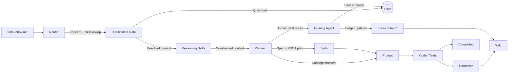

# Architecture Overview

This page narrates how the Concept–Synchronization architecture, PDCA/spec workflow, and Skill layer interlock. For authoritative instructions, defer to `AGENTS.md`, Concept manifests inside `/concepts/`, Synchronization contracts in `/synchronizations/`, and the Codex operational framework in `docs/agents.md`.

## Layers at a Glance
1. **Concepts** own user-facing behavior. Each manifest describes purpose, handlers, data, dependencies, and validations.
2. **Synchronizations** define contracts between Concepts so cross-module work stays explicit.
3. **Specs** (in `/specs/` + `/specs/lib/`) encode PDCA requirements before any change.
4. **Reasoning Skills** (in `/skills/reasoning/`) are deterministic, non-executing manifests that constrain planning before any code work begins.
5. **Skills** (in `/skills/`) capture reusable, deterministic capabilities (tool packages) tied to a spec (and optionally a Concept), letting agents route work without embedding prompts or vendor lock-in.
6. **Operational Docs** (`todo.md`, `todo-inbox.md`, `backlog.md`, `handover.md`, `docs/security.md`, `docs/context-management.md`, `docs/humans/workflow-guide.md`, `CHANGELOG.md`, etc.) ensure execution evidence, governance, and context ledgers remain auditable.

## Flow Narrative
- Intake items land in `todo-inbox.md` and are routed by the Router/Planner to a single Concept and (optionally) a Skill.
- Clarification Gate runs before planning; it asks targeted questions when inputs are ambiguous and records answers in the active spec under `Clarifications`.
- Reasoning Skills run after Clarification Gate and before planning; they enforce deterministic constraints, emit structured logs, and halt the run on violations.
- The Planner enforces PDCA by referencing the governing spec and ensuring any cross-concept work starts with a Synchronization contract.
- Before execution begins (or whenever the feature/domain shifts), the Pruning Agent reviews each ledger in `docs/context/`, requests user approval to archive stale entries, and posts the resulting archive links.
- The Prompt Optimizer loads the Concept manifest, Synchronization file, and Skill instructions into the active prompt before code is generated.
- Execution results plus validation evidence feed back into the PDCA loop (`completed.md`, `handover.md`, specs) and, when architectural reasoning shifts, into this wiki.

### Concept ↔ Synchronization ↔ Skill Relationship
- Concepts remain the only place to change runtime code; Skills cannot override manifest rules.
- Synchronizations call out when Concepts collaborate; Skills reference these contracts when their scope spans multiple concepts.
- Skills attach to specs/Concepts to encode repeatable execution and validation (schema-defined I/O, deterministic runtime) without duplicating manifests.

### High-level Diagram

## Where the Wiki Fits
- This wiki records why decisions were made (see `design-decisions.md`), common patterns, and repeatable playbooks.
- It never supersedes `AGENTS.md`, specs, manifests, or Skill files. When conflicts appear, defer to the authoritative document and update the wiki summary.
- Use the wiki to onboard humans/agents quickly and to find which Skill or playbook to apply before starting work. Reference `docs/context-management.md` for the authoritative ledger/pruning protocol, `docs/humans/workflow-guide.md` for a project-agnostic framework overview (including the workflow sequence), and `CHANGELOG.md` for the chronological record of completed work.
